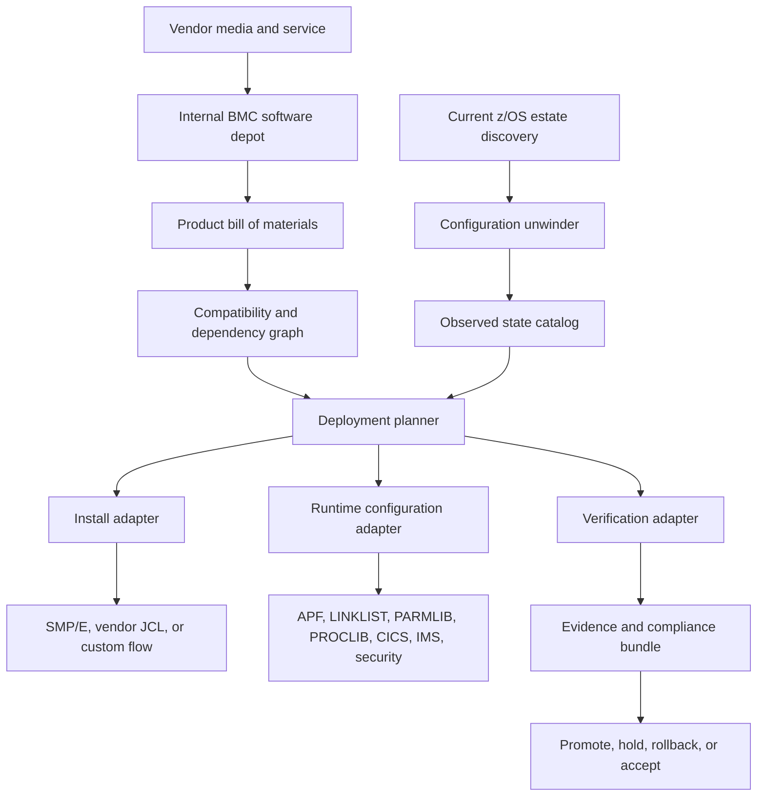

# BMC Software Lifecycle Strategy on z/OS

## Purpose

Define a strategy for installing, updating, configuring, auditing, and recovering BMC Software products on z/OS through Ansible when the product estate has varied install methods, extensive local configuration, and no established SMP/E repository standard.

This is a planning and brainstorming document. It intentionally includes conservative options and aggressive ideas. Implementation should start only after the product inventory and install evidence are collected.

## Core Problem

BMC product deployment is not one problem. It is several overlapping problems:

- Some products are SMP/E-packaged.
- Some products may use vendor-generated JCL, custom install jobs, runtime customization jobs, or ISPF-driven setup flows.
- Some products share common libraries, panels, skeletons, exits, started tasks, or infrastructure components.
- Local customization may be buried in PROCLIB, PARMLIB, CLIST/REXX, ISPF tables, CICS definitions, IMS PROCLIB, DB2 plans/packages, security rules, exits, and product-specific parameter members.
- The current state may not match vendor docs, previous install jobs, or SMP/E metadata.
- There may be no disciplined internal repository for BMC base media, service media, HOLDDATA, generated JCL, applied maintenance, or local overrides.

The automation design must therefore build a product lifecycle control plane, not just playbooks that submit install JCL.

## Guiding Model

Treat every BMC product as a package with four separate layers:

1. **Vendor media layer**
   - Original product package.
   - Service package.
   - HOLDDATA or equivalent advisory material.
   - Vendor-generated install assets.

2. **Install state layer**
   - SMP/E global, target, and distribution zones where applicable.
   - Target and distribution libraries.
   - Vendor sample libraries.
   - Generated install reports.

3. **Runtime integration layer**
   - APF, LINKLIST, LPA, PARMLIB, PROCLIB, started tasks.
   - Security definitions.
   - CICS hooks, resources, exits, PLT/SIT references, and transaction definitions.
   - IMS hooks, PROCLIB changes, exits, DBRC or catalog references.
   - DB2 plans/packages or subsystem references where applicable.

4. **Local configuration layer**
   - Product parameter members.
   - Site exits.
   - Usermods.
   - REXX/CLIST wrappers.
   - Operations procedures.
   - Scheduler jobs.
   - Monitoring and alerting rules.

Each layer needs its own discovery, deployment, verification, rollback, and ownership model.

## Proposed Architecture



## Internal BMC Software Depot

Because no established SMP/E repositories exist, create one. Do not wait for a perfect vendor-native repository model.

The depot should store:

- Original vendor packages, immutable.
- Service packages, immutable.
- Expanded package contents.
- Checksums and signatures where available.
- Product documentation snapshots.
- Installation instructions and generated JCL.
- SMP/E input datasets or USS payloads.
- HOLDDATA or equivalent advisories.
- Local product definition YAML.
- Product dependency metadata.
- Approved runtime customization templates.
- Evidence from every deployment.

Recommended structure:

```text
depot/
  bmc/
    products/
      <product-code>/
        <version>/
          media/
          expanded/
          service/
          holdata/
          vendor-jcl/
          product-definition.yml
          dependency-graph.yml
          checksums.txt
          release-notes/
          evidence/
```

The depot can start as Git plus large artifact storage. It can evolve into Nexus, Artifactory, S3-compatible storage, SharePoint-backed storage, or an internal API.

## Product Definition Schema

Every BMC product should have a product definition that describes the product independent of any one LPAR.

Required fields:

- Product name.
- Product code.
- Version and release.
- FMIDs, if applicable.
- Install method.
- Media package identifiers.
- Service package identifiers.
- Required BMC common components.
- Required z/OS, CICS, IMS, DB2, MQ, Java, or LE levels.
- SMP/E CSI strategy.
- Target and distribution zones.
- Runtime libraries.
- APF requirements.
- LINKLIST or STEPLIB requirements.
- LPA requirements.
- PARMLIB members.
- PROCLIB members.
- Started tasks.
- Security profiles and started task IDs.
- CICS integration points.
- IMS integration points.
- DB2 integration points.
- Product verification commands.
- Backout classification.
- ACCEPT policy.

Install method should be one of:

- `smpe_managed`
- `vendor_jcl_managed`
- `runtime_only`
- `hybrid_smpe_plus_runtime`
- `legacy_manual_capture`
- `unknown_pending_discovery`

## Install Adapter Pattern

Use one common Ansible interface with multiple install adapters underneath.

All adapters should expose the same phases:

- `discover`
- `plan`
- `stage`
- `check`
- `apply`
- `verify`
- `evidence`
- `recover`
- `accept`, only when meaningful

Adapter types:

### SMP/E Adapter

Use for products with normal SMP/E packaging.

Responsibilities:

- Stage SMPPTFIN, SMPHOLD, RELFILEs, or package contents.
- Allocate or validate CSI, SMPPTS, zones, DDDEFs, target libraries, and distribution libraries.
- Run RECEIVE CHECK where useful.
- Run RECEIVE.
- Run APPLY CHECK.
- Run APPLY only after approval.
- Delay ACCEPT until after soak validation.
- Query installed FMID and SYSMOD state.
- Capture SMP/E reports.

### Vendor JCL Adapter

Use for products driven by vendor-supplied or generated JCL.

Responsibilities:

- Render JCL with environment-specific symbolic values.
- Validate all referenced datasets before submit.
- Submit jobs in dependency order.
- Parse return codes and expected messages.
- Capture JES output.
- Install or update generated members only through controlled promotion.
- Produce a synthetic installed-state marker if the product lacks machine-readable state.

### Runtime Configuration Adapter

Use for products where the install bits already exist but integration is the hard part.

Responsibilities:

- Update APF, LINKLIST, LPA, PROCLIB, PARMLIB, product parameter libraries, CICS, IMS, DB2, and security definitions.
- Create before/after snapshots.
- Require approval for invasive changes.
- Trigger LLA refresh, started task recycle, CICS resource install, IMS command, or IPL scheduling when required.

### Legacy Capture Adapter

Use when an existing installation is too manually configured to automate directly.

Responsibilities:

- Discover current state.
- Capture and classify configuration.
- Generate a product definition from observed state.
- Identify drift from vendor baseline.
- Mark unknowns explicitly.
- Avoid making changes until the product owner approves the captured model.

## Configuration Unwinding Strategy

The hard part is not only installation. It is unwinding years of configuration.

Use a three-pass approach:

### Pass 1: Inventory

Collect everything without judging it:

- SMP/E CSI entries.
- Product library lists.
- Dataset naming patterns.
- PROCLIB members.
- PARMLIB members.
- APF list.
- LINKLIST.
- LPA.
- Started tasks.
- Security definitions.
- CICS CSD/CMCI resources.
- IMS PROCLIB and command output.
- Product parameter datasets.
- Scheduler jobs.
- REXX/CLIST/ISPF assets.
- Operator procedures and runbooks.

### Pass 2: Attribution

For each discovered artifact, classify:

- Belongs to BMC product base.
- Belongs to BMC shared infrastructure.
- Belongs to CICS integration.
- Belongs to IMS integration.
- Belongs to DB2 integration.
- Local site override.
- Historical dead config.
- Unknown.

### Pass 3: Normalization

Convert approved findings into declarative product definitions:

- Keep vendor base and site override separate.
- Preserve local customizations as explicit overlays.
- Add owner and rationale metadata.
- Add verification for every critical runtime dependency.
- Add rollback notes for every invasive change.

## Update Strategy

Use a promotion ring model:

1. **Depot intake**
   - New BMC media or service enters the internal depot.
   - Package is immutable and checksummed.
   - Product definition is updated or generated.

2. **Static analysis**
   - Compare new package against prior package.
   - Extract FMIDs, SYSMOD IDs, JCL changes, sample changes, and documented hold actions.
   - Flag APF, LINKLIST, PARMLIB, PROCLIB, CICS, IMS, and DB2 impact.

3. **Sandbox apply**
   - Deploy to an isolated sandbox CSI and runtime library set.
   - Run APPLY CHECK and APPLY where applicable.
   - Run vendor customization jobs.
   - Capture all output.

4. **Integration test**
   - Connect to disposable or test CICS/IMS regions.
   - Verify product starts and hooks work.
   - Run smoke checks.

5. **Promotion candidate**
   - Freeze the product definition, generated JCL, and evidence.
   - Create a deployment manifest.
   - Review by system programming, middleware, security, and operations.

6. **Controlled rollout**
   - Roll through dev, test, QA, and production.
   - Do not ACCEPT immediately unless policy requires it.
   - Keep backout path open through the soak period.

7. **Accept or hold**
   - ACCEPT only after confidence criteria are met.
   - If problems occur, RESTORE where SMP/E supports it or activate product-specific backout.

## Wild Ideas Worth Considering

### Build an Internal "Pseudo SMP/E Repo"

Even if BMC does not give you a repo, build an internal repository abstraction that speaks in product versions, FMIDs, service levels, and dependencies.

The backend can be crude at first: files, YAML, checksums, and evidence. The important part is the interface:

- `available_versions`
- `installed_versions`
- `pending_service`
- `dependency_graph`
- `promotion_status`
- `deployment_manifest`

### Treat BMC Runtime State Like Kubernetes Desired State

Define desired runtime state for each LPAR:

- Required libraries.
- Required APF entries.
- Required started tasks.
- Required CICS hooks.
- Required IMS hooks.
- Required security definitions.

Then continuously compare desired state to observed state. First report drift only. Later, allow controlled remediation.

### Create a Configuration Archaeology Pipeline

Build read-only jobs that scrape PROCLIB, PARMLIB, APF, LINKLIST, CICS, IMS, scheduler, and product libraries, then infer what product owns each artifact.

Output:

- Product ownership map.
- Unknown config backlog.
- Dead config candidates.
- Risk map for each product update.

### Use a Graph Database or Graph File

BMC product estates are dependency graphs, not lists.

Model:

- Product depends on FMID.
- FMID deploys library.
- Library appears in APF.
- Started task uses PROC.
- PROC points to parameter member.
- Parameter member references CICS region.
- CICS region references program or exit.
- Security profile permits STC user.

This can start as YAML and Mermaid. If it grows, move to Neo4j, SQLite, or a graph-oriented inventory service.

### Build Blue/Green BMC Runtime Libraries

For products that tolerate STEPLIB or proc-level indirection, install new libraries side-by-side:

- `BMC.PROD.V1R2M0.*`
- `BMC.PROD.V1R2M1.*`

Then switch started task PROCs, CICS references, or IMS references through symbolic variables or controlled include members. This improves rollback because old libraries remain intact.

### Create a Product "Flight Recorder"

Every deployment produces an immutable flight recorder bundle:

- Input product definition.
- Environment variables.
- Rendered JCL.
- JES output.
- SMP/E reports.
- Before/after state.
- Operator commands.
- Verification output.
- Approvals.
- Human notes.

This becomes the real system of record when vendor docs, local memory, and install history disagree.

### Generate Human-Readable Runbooks from the Same Metadata

Do not maintain runbooks by hand. Generate them from product definitions:

- Install steps.
- Expected jobs.
- Expected return codes.
- Required approvals.
- Backout steps.
- Verification commands.
- Contact owners.

### Create a "Do Nothing But Tell Me" Mode

Before any product is automated, the tool should answer:

- What would change?
- Which jobs would run?
- Which libraries would be touched?
- Which regions would recycle?
- Which approvals are needed?
- What is the backout path?
- What evidence will be produced?

This mode is likely the fastest way to gain trust.

### Mine Prior JES Output

If historical JES logs exist, use them to reverse-engineer:

- Install job sequences.
- Return-code expectations.
- Dataset names.
- Product messages.
- Custom steps that are not in current docs.

This is especially useful for products with weak or missing current install metadata.

## Risk Register

| Risk | Mitigation |
| --- | --- |
| Product install method is unknown | Start every product in `unknown_pending_discovery`; no automated change until classified. |
| Existing config is undocumented | Run read-only configuration unwinding first. |
| SMP/E state is incomplete or inconsistent | Query CSI and compare against libraries, PROCs, and runtime state. |
| Vendor JCL is not idempotent | Wrap it with prechecks, backups, markers, and expected-output assertions. |
| ACCEPT closes rollback path | Separate ACCEPT from APPLY and require explicit approval. |
| Runtime hooks are riskier than base install | Separate base install from runtime integration and require independent approvals. |
| CICS/IMS recycle impact is unclear | Model affected regions and commands in the deployment manifest. |
| Shared BMC components cause hidden coupling | Build a dependency graph and product ownership map. |
| Local customizations get overwritten | Preserve customizations as overlays and compare before replacement. |
| Drift after deployment | Add recurring read-only compliance checks before enabling remediation. |

## Initial Discovery Backlog

1. List all BMC products, versions, product codes, and business owners.
2. Collect current BMC HLQs and product libraries.
3. Identify all BMC-related SMP/E CSIs and zones.
4. Identify BMC-related APF, LINKLIST, LPA, PARMLIB, and PROCLIB entries.
5. Identify BMC started tasks and STC user IDs.
6. Identify BMC hooks in CICS regions.
7. Identify BMC hooks in IMS regions.
8. Identify DB2, MQ, TCP/IP, Java, or USS dependencies.
9. Collect available vendor media and service packages.
10. Collect historical install and maintenance jobs.
11. Collect product-specific runbooks.
12. Classify each product install method.
13. Select two pilot products:
    - One SMP/E-heavy product.
    - One runtime-customization-heavy product.

## Near-Term Recommendation

Do not start by automating product installs. Start by building the inventory and depot:

1. Create the product definition schema.
2. Create the internal BMC software depot structure.
3. Write read-only discovery playbooks.
4. Generate a product ownership and dependency report.
5. Pick two pilot products.
6. Build install adapters only after the product methods are known.

This creates leverage. Once the depot, product definition, and evidence model exist, each BMC product becomes an onboarding exercise instead of a bespoke automation project.

## Source Notes

IBM SMP/E documentation establishes the lifecycle semantics this strategy relies on:

- RECEIVE reads SYSMODs and HOLDDATA and stages them into SMP/E-controlled state for later processing.
- APPLY installs SYSMOD elements into target system libraries and records the service level in the target zone.
- ACCEPT installs SYSMOD elements into distribution libraries and records that state in the distribution zone.

Public BMC documentation search did not produce a stable open reference for a single consistent BMC install method. The strategy therefore assumes BMC products must be classified from actual product media, local install artifacts, and site-specific evidence.
